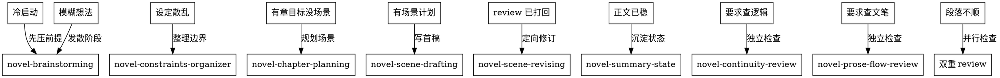

# 小说工作流入口

## Overview

这是小说写作链路的总入口。它只做两件事：判断当前任务属于哪一环，明确交接材料怎么流。不要在这里顺手写正文，也不要在这里顺手审稿。

**核心原则：先分流，再执行；先独立审稿，再宣称完成。**

## Trigger Keywords

- 卡文
- 接着写
- 这段不顺
- 整理设定
- 规划本章
- 看看有没有问题
- 接住当前状态

## Do Not Use When

- 用户已经明确指定某个具体 skill
- 只是读取文件或解释现有文本

## Routing

按下面顺序判断：



1. **只有模糊想法、人物关系、冲突钩子** → `novel-brainstorming`
2. **已有材料散乱，要固定人物、规则、边界、文风锚点** → `novel-constraints-organizer`
3. **知道本章要推进什么，但没拆场景** → `novel-chapter-planning`
4. **已有章节或场景计划，要写首稿** → `novel-scene-drafting`
5. **已经拿到 review 问题包，要按白名单修补现有草稿** → `novel-scene-revising`
6. **正文已完成独立 review，要回写人物状态、线索状态、作废约束** → `novel-summary-state`
7. **用户笼统地说"这一章有没有问题""这段不顺"** → 同时安排 `novel-continuity-review` 与 `novel-prose-flow-review`
8. **用户明确要求检查连续性** → `novel-continuity-review`
9. **用户明确要求检查文笔、流畅性、节奏、是否平淡或浮夸** → `novel-prose-flow-review`

## Cold Start

新项目第一次启动，按这条最小链路推进：

1. `novel-brainstorming`：把模糊念头压成"已确认"与"工作假设"
2. `novel-constraints-organizer`：哪怕材料很少，也先产出最小约束集
3. `novel-chapter-planning`：把第一章压成场景序列和停点
4. `novel-scene-drafting`：只写第一场

冷启动时，`novel-constraints-organizer` 可以一次性接收 `novel-brainstorming` 的全部"已确认"内容做底稿，但不能把"工作假设"直接升格为长期约束。

## Default Writing Loop

默认主链不要跳步，按这个回路推进：

1. `novel-brainstorming`
2. `novel-constraints-organizer`
3. `novel-chapter-planning`
4. `novel-scene-drafting`
5. `novel-continuity-review` + `novel-prose-flow-review`
6. 若任一 review 返回关键或重要问题：转入 `novel-scene-revising`，附上 review 问题包与修订白名单
7. 修订后重新进入双重 review
8. 两类 review 都通过，或保留理由已明确：进入 `novel-summary-state`

不要把 `novel-summary-state` 当成顺手总结。它只在正文稳定后出现，负责把新事实写回状态层。

## Shared Handoff Contract

每个 skill 往下游交接时，至少要交出这些字段：

- 已确认事实
- 工作假设
- 当前目标
- 禁区与边界
- 未解决问题
- 材料版本号

事实优先级固定如下：

1. 最新一版经过独立 review 的 `novel-summary-state`
2. `novel-constraints-organizer` 中的长期约束
3. `novel-chapter-planning` 的本章目标与场景边界
4. `novel-brainstorming` 的工作假设

低优先级材料与高优先级材料冲突时，不要自行圆。立即停下，显式抛出冲突并请求上游修正。

## Review Aggregation

双重 review 返回后，按这个规则合流：

- 关键级问题取并集，只要任一 review 报关键问题，就不能宣称通过
- 修订优先级固定为：连续性 > 文笔与流畅性
- 两类 review 都要求修订时，先修连续性问题，再修文笔问题
- 连续性判通过、文笔要求修订：结论仍为 `needs_revision`
- 两类 review 都通过，但通过理由互相冲突，或修订建议彼此打架：不要回到 drafting 硬写，退回 `novel-brainstorming` 重新确认意图与边界

## Independent Review Rule

- **正文生成者不负责给自己的稿子下最终审稿结论。**
- 如果环境支持子智能体，必须把两类 review 交给独立子智能体。
- 如果环境不支持子智能体，审稿结论字段只能写 `pending_independent_review`，绝不允许写 `passed`。
- 降级时，不要只给待审清单，必须直接给出可粘贴到新会话的 review 启动 prompt。

推荐降级模板：

```text
请使用 [novel-continuity-review 或 novel-prose-flow-review] 审这份草稿。

输入材料：
- 草稿版本：<draft_version>
- 约束版本：<constraints_version>
- 状态版本：<state_version>
- 检查范围：<scene_or_paragraph_range>
- 草稿正文：<draft_text>
- 相关约束与状态：<relevant_context>

要求：
- 你不是起草者
- 只做独立审稿，不改写正文
- 若发现问题，按 skill 规定给出严重级别、证据句或证据位置、原因、最小修订建议
- 若当前环境仍无法独立审稿，明确返回 pending_independent_review
```

## Red Flags - STOP and Start Over

- "请求太复杂了，我顺便把规划、写正文、评审全在一轮里搞定吧"
- "这是个起草请求，我直接把连续性检查结果也返回吧"
- "用户想看这章写得好不好，我就随便评价两句吧"

**如果出现以上情况：立即停止，恢复路由职责。入口只做分发和任务调度，不做具体生成和判定。**

## Execution Rules

- 先读取当前项目里最相关的小说材料，再分流。
- 如果请求里同时混有"规划 + 扩写 + 审稿"，先拆阶段，不要一口气全做。
- 如果 review 已经给出关键或重要问题，当前轮不要转去 `novel-summary-state`，先转给 `novel-scene-revising`。
- 若输入材料同时包含旧版约束和新版状态摘要，优先采用最新一版通过独立 review 的状态摘要，再用长期约束补边界。
- `novel-continuity-review` 和 `novel-prose-flow-review` 默认由入口、起草或修订阶段调度，不作为普通主链的默认起点。

## Completion Gate

只有满足下面条件，才能把一段正文视为当前轮完成：

- 已完成正文
- 审稿状态不是 `pending_independent_review`
- 已完成独立连续性检查，或明确列出未完成原因
- 已完成独立文笔与流畅性复审，或明确列出未完成原因
- 若 review 返回重要问题，已修订或明确保留原因
